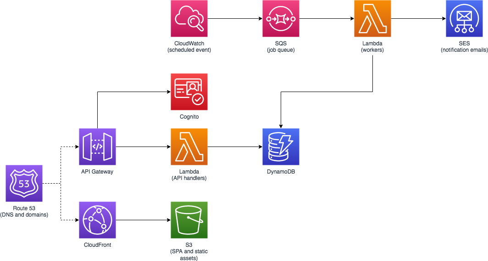

# carlosafonso/site-alerter

(This is a WIP project.)

The aim of this project is to develop a serverless tool that alerts users when contents of a site change. This is useful to track changes to relatively static websites without having to manually check them.

## Architecture



## Deploying the app

Use `sam-local` with the included CloudFormation template.

```
# first create an S3 bucket to store SAM artifacts
aws s3 mb <your bucket name>

# build the project
sam build

# now package the SAM app
sam package --output-template-file packaged.yaml --s3-bucket <your bucket name>

# and finally deploy it
aws cloudformation deploy \
	--template-file /path/to/packaged.yaml \
	--stack-name <your stack name> \
	--parameter-overrides "Env=<your environment name>" "VPCName=<your VPC name>" \
	--capabilities=CAPABILITY_IAM
```

## Local development

```
# Start DynamoDB Local (this command works if DDB Local was installed via Brew)
dynamodb-local -sharedDb

# Create the Urls table
aws --endpoint-url=http://localhost:8000 \
	dynamodb create-table --cli-input-json file://./util/urls_table_definition.json

# Start the API
sam local start-api -n env.dev.json
```
